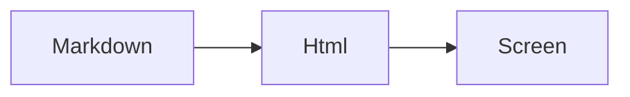

# Readmd Visual Fixture

This screen test opens a real app window and captures the rendered Markdown area.

## Common Syntax

- **Strong text** and *emphasized text*
- `inline code`
- [A link](https://example.com)
- [x] a checked task
- [ ] an unchecked task

> Blockquotes should have a left rule and muted text.

| Feature | Expected |
| --- | --- |
| Tables | Visible grid |
| Code | Monospace block |
| Images | Size-constrained |

```csharp
public static string Hello() => "markdown";
```


